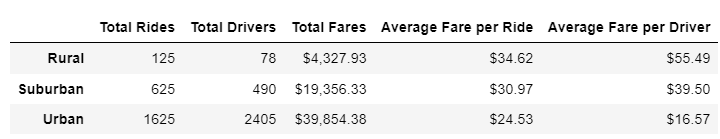
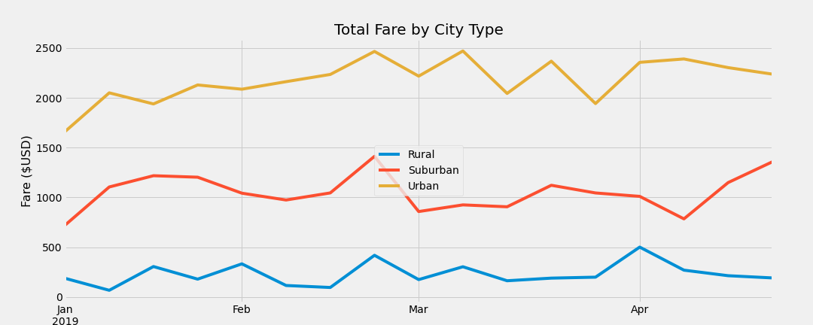

# PyBer Analysis

## Overview of the analysis:
PyBer, a Python-based ride-sharing app company, requires an analysis of the relationship between types of cities and number of riders and drivers; as well as the percentage of total fares, riders and drivers by type of city.

This analysis will help the company improve access to ridesharing services and determine affordability for underserved neighborhoods.
## Results:

As shown by the summary below, there are more drivers than rides in urban centers, while rural and suburban locations are underserved.

*Summary of total and average fares per type of city.*

A large percentage of the fares are spent in urban areas (68% of rides are in urban cities), however the average fare per driver is lower than the average fare per ride, due to a large portion of the drivers being idle.

*Plot chart of average fares per week between January and April 2019 for each type of city.*

As shown above, there is currently less total spend in rural and suburban areas per week, but the cost of a single ride is considerably higher in these locations.

## Summary:

Based on the results, the following recommendations are proposed:
- There is not sufficient demand in urban centers for the available drivers, so the fares need to be reduced considerably, to incentivize more riders.
- The average fare per ride in rural centers is currently high. This could be fixed if there was a higher supply of drivers. By lowering the fares in urban centers, we would also be incentivizing drivers to move their services from urban to rural areas.
- Suburban areas stand in between the rural and urban areas and would also benefit from the lower fares in urban centers. They would get more drivers and potentially lower fares per ride.